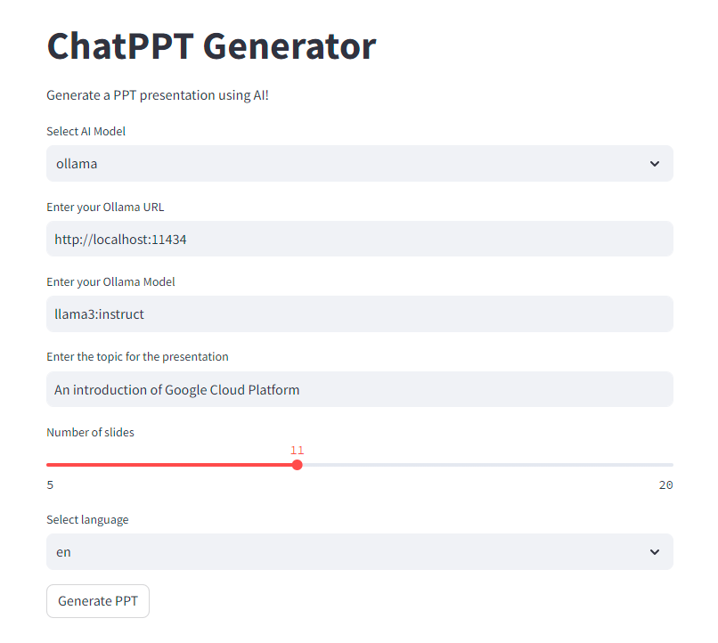
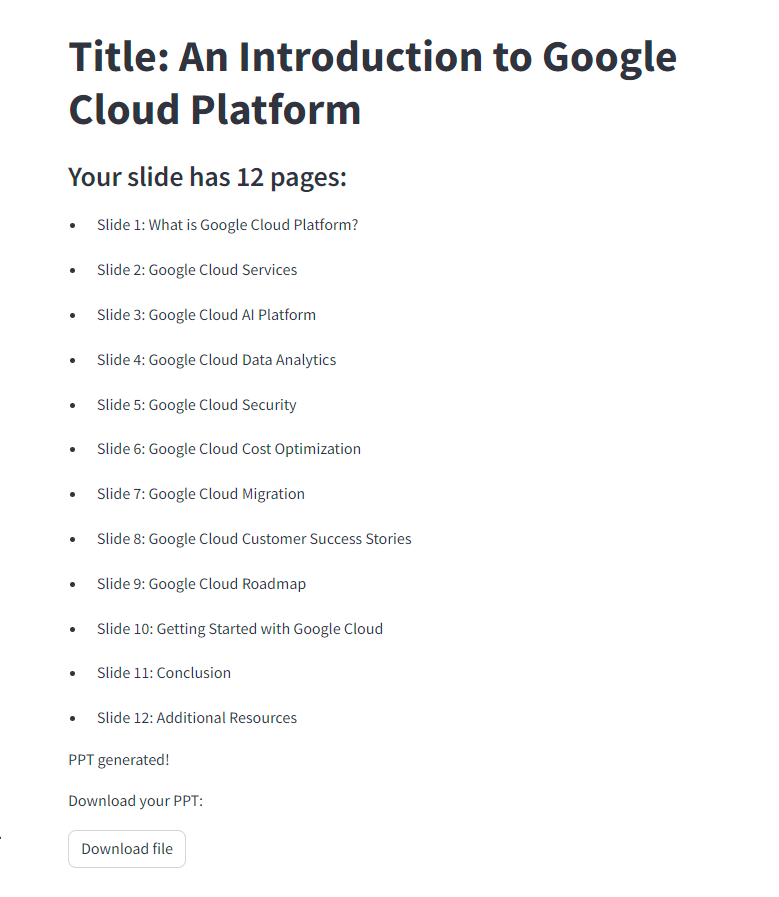
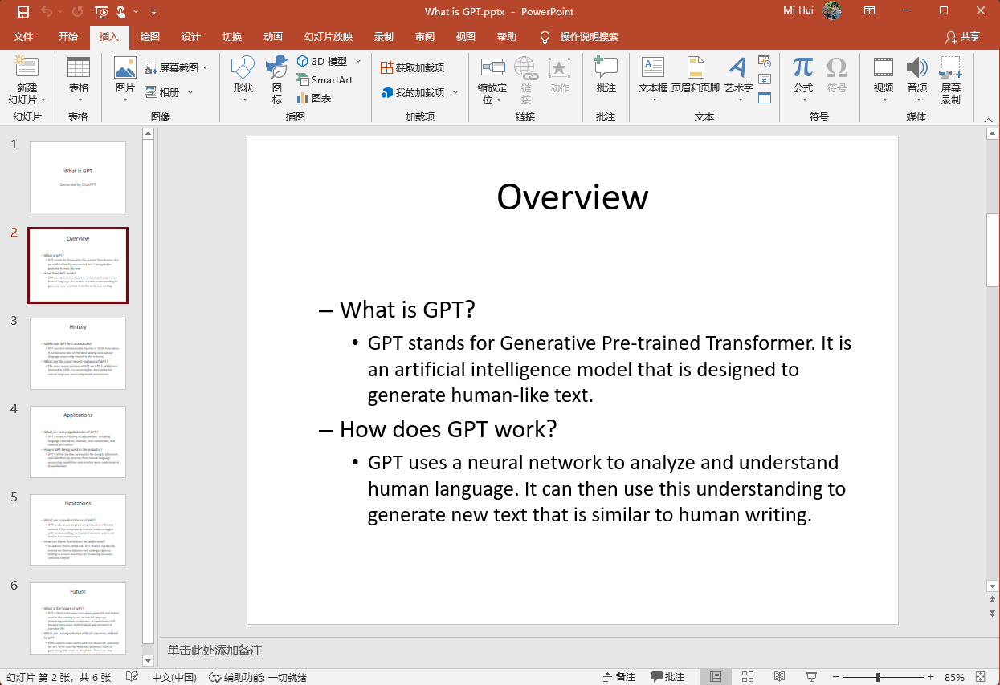
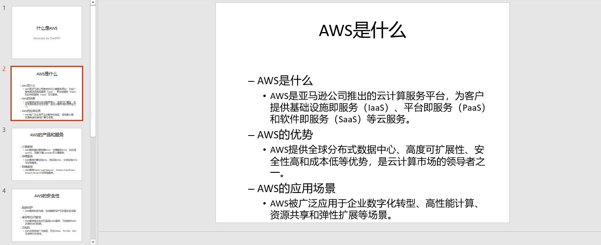
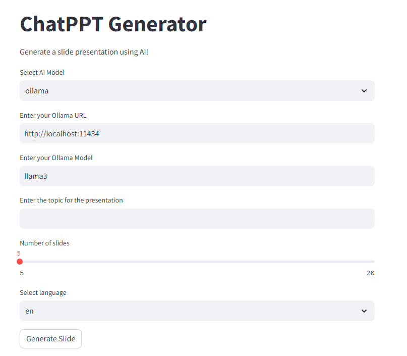

# ChatPPT

ChatPPT is a tool powered by chatgpt/ollama that helps you generate PPT/slide. It supports output in English and Chinese.

## Table of Contents

- [What's New](#whats-new)
- [What is ChatPPT](#what-is-chatppt)
- [Requirements](#requirements)
- [Installation](#installation)
- [Usage](#usage)
- [Contributing](#contributing)
- [License](#license)

## What's New

ChatPPT now supports Ollama and includes a sample UI.




## What is ChatPPT

ChatPPT is powered by chatgpt/ollama. It can help you generate PPT/slide in English and Chinese.




## Requirements

Python 3.8.10 or higher

## Installation

### Ollama

Follow the [guide](https://ollama.com/) to install ollama

### OpenAI

Generate your OpenAI API key at <https://platform.openai.com/account/api-keys>

## Usage

1. Install requirements

    ```
    pip install -r requirements.txt
    ```

2. Start Streamlit

    ```
    streamlit run chatppt_ui.py
    ```

3. Open the Streamlit URL in your browser (<http://localhost:8501>)



> You can also use ChatPPT in the command line:

```bash
> python chatppt.py -h
usage: chatppt.py [-h] [-m {openai,ollama}] -t TOPIC [-k API_KEY] [-u OLLAMA_URL] [-o OLLAMA_MODEL] [-p PAGES] [-l {cn,en}]

I am your PPT assistant, I can help to you generate PPT.

options:
  -h, --help            show this help message and exit
  -m {openai,ollama}, --ai_model {openai,ollama}
                        Select the AI model
  -t TOPIC, --topic TOPIC
                        Your topic name
  -k API_KEY, --api_key API_KEY
                        Your api key file path
  -u OLLAMA_URL, --ollama_url OLLAMA_URL
                        Your ollama url
  -o OLLAMA_MODEL, --ollama_model OLLAMA_MODEL
                        Specify the Ollama model to use
  -p PAGES, --pages PAGES
                        How many slides to generate
  -l {cn,en}, --language {cn,en}
                        Output language
